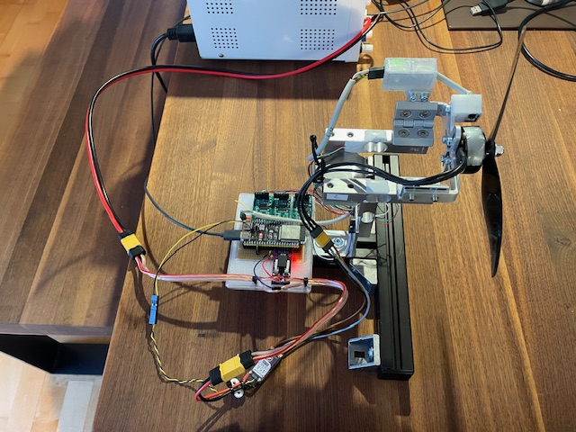
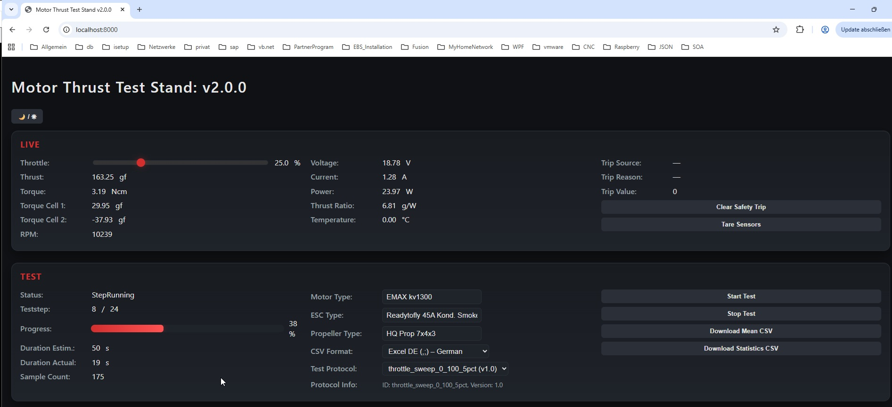

# Motor Thrust Test Stand (ESP32)

An ESP32-based brushless motor thrust test stand for measuring, logging, and analyzing propulsion data of brushless motors and propellers via a web-based interface.

The system controls a brushless ESC, reads multiple sensors in real time, performs automated thrust test sequences using configurable test protocols, and exports results as CSV files for further analysis.

This project was inspired by:  
<https://github.com/avenhaus/thrust_stand/tree/main>  
<https://github.com/iforce2d/thrustTester>  
<https://www.tytorobotics.com/pages/series-1580-1585>

---

## Features

- Brushless motor ESC control (manual and automated)
- Real-time measurement of:
  - Thrust
  - Torque
  - Current
  - Voltage
  - Electrical power
  - RPM
  - Temperature
- Aggregated values including power and thrust-to-power ratio
- **JSON-based test protocols**
  - Multiple protocol definitions supported
  - Up to **10 test protocols stored persistently** on the device
  - Protocols can be uploaded, selected, and executed via the Web UI
- Automated thrust tests based on customizable test protocols
- Live web-based user interface (ESP32 Access Point)
- CSV export of test data
- Sensor calibration via web interface
- Persistent configuration using NVS
- LittleFS-based filesystem

### Safety Features

- Hardware Emergency Stop (E-Stop)
- Propeller cage door safety switch
- **Configurable safety trip concept**
  - Monitors critical parameters such as current, voltage, temperature, RPM, and thrust
  - Automatic motor shutdown when limits are exceeded
  - Safety trips are active during both manual and automated operation
- Visual system state indication via RGB status LED

---

## System Overview

The Thrust Test Stand software is divided into three main components.

### ThrustStand

Hardware abstraction and data acquisition layer:

- Initializes and updates all sensors
- Controls the ESC and throttle
- Accumulates and averages sensor data
- Provides a machine-level state snapshot without UI logic

### ThrustTestController

Automated test execution layer:

- Step-based throttle sequencing
- Acceleration, hold, and deceleration timing
- Test progress tracking
- Execution of stored test protocols
- Test metadata handling (motor, ESC, propeller)
- CSV export to LittleFS

### WebServerController

Web-based control and visualization layer:

- ESP32 operates as a Wi-Fi Access Point
- REST-style API endpoints
- Live JSON status updates
- Sensor calibration endpoints
- Test protocol management (upload, select, delete)
- Test control (start/stop)
- CSV download
- Static HTML/JavaScript frontend served from LittleFS

---

## Documentation

Additional documentation has been split into dedicated files:

- **Hardware design, wiring, and sensors:**  
  [README_Hardware.md](README_Hardware.md)

- **Test protocol format and execution model:**  
  [README_TestProtocol.md](README_TestProtocol.md)

---

## Media

- Overall test stand  
  

- ESP32 and sensor electronics overview  
  

- Web UI Frontend with Live and Test-Section  
Additional Sections are System State, Safety, Configuration, Protocols  

---

## Test Data

Each automated test step records:

- Throttle percentage
- Thrust (gf)
- Torque (Ncm)
- Voltage (V)
- Current (A)
- Electrical power (W)
- Efficiency (gf/W)
- RPM
- Temperature (°C)

Data is buffered in memory during the test and written to LittleFS as a CSV file upon completion.

---

## Build Environment

- PlatformIO
- ESP32 Arduino Framework
- Libraries:
  - ESPAsyncWebServer
  - AsyncTCP
  - HX711_ADC
  - Adafruit ADS1X15
  - Adafruit MAX31855
  - INA226
  - LittleFS

---

## Safety Notice

This system controls high-power rotating machinery.

- Always ensure the Emergency Stop is accessible
- Secure the motor and propeller firmly
- Never stand in the propeller plane
- Perform initial tests at low throttle settings

---

## License

Licensed under the Apache License, Version 2.0.

<http://www.apache.org/licenses/LICENSE-2.0>
