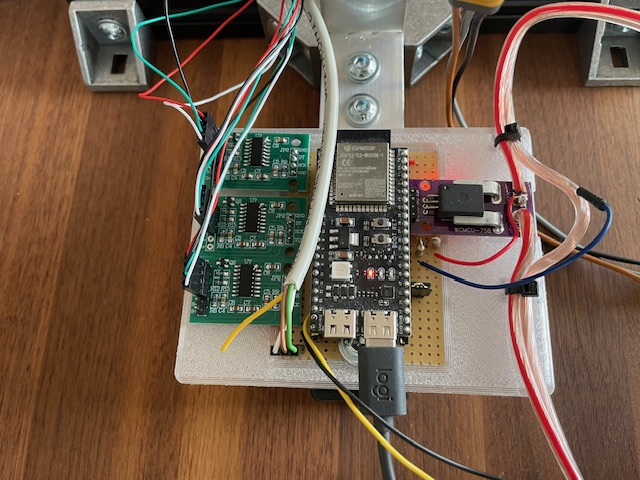
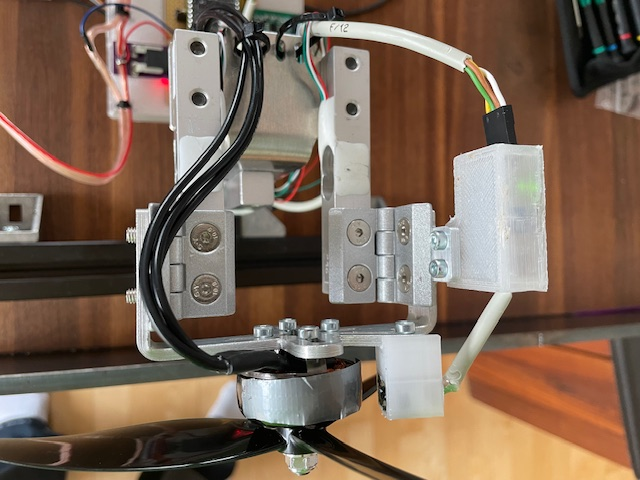

# Motor Thrust Test Stand (ESP32)

An ESP32-based brushless motor thrust test stand for measuring, logging, and analyzing propulsion data of brushless motors and propellers via a web-based interface.

The system controls a brushless ESC, reads multiple sensors in real time, performs automated thrust test sequences, and exports results as CSV files for further analysis.

---

## Features

- Brushless motor ESC control (manual and automated)
- Real-time measurement of:
  - Thrust
  - Torque
  - Current
  - Voltage
  - Electrical power
  - RPM
  - Temperature
- Aggregated values including power and thrust-to-power ratio
- Automated step-based thrust tests
- Live web-based user interface (ESP32 Access Point)
- CSV export of test data
- Sensor calibration via web interface
- Emergency Stop (E-Stop) integration
- Persistent configuration using NVS
- LittleFS-based filesystem

---

## System Overview

The Thrust Test Stand software is divided into three main components.

### ThrustStand

Hardware abstraction and data acquisition layer:
- Initializes and updates all sensors
- Controls the ESC and throttle
- Accumulates and averages sensor data
- Provides a machine-level state snapshot without UI logic

### ThrustTestController

Automated test execution layer:
- Step-based throttle sequencing
- Acceleration, hold, and deceleration timing
- Test progress tracking
- Test metadata handling (motor, ESC, propeller)
- CSV export to LittleFS

### WebServerController

Web-based control and visualization layer:
- ESP32 operates as a Wi-Fi Access Point
- REST-style API endpoints
- Live JSON status updates
- Sensor calibration endpoints
- Test control (start/stop)
- CSV download
- Static HTML/JavaScript frontend served from LittleFS

---

## Hardware

### Microcontroller
- ESP32-S3 WROOM-1 DevKit

### Sensors
- Thrust:
  - Load cell (5 kg) with HX711 ADC
- Torque:
  - Dual load cells (2 x 2 kg) with HX711 ADC
  - Lever-arm based torque calculation
- Current:
  - ACS758 hall-effect current sensor
- Voltage:
  - Resistor divider (10 kOhm / 1 kOhm, max approx. 33 V)
- RPM:
  - Infrared reflective optical sensor
- Temperature:
  - Thermocouple sensor (MAX31855)

### Actuators and Safety
- Brushless ESC (PWM control)
- Configurable pulse range:
  - Default: 1000–2000 µs
  - Allowed: 800–2200 µs
- Hardware Emergency Stop (E-Stop)
- RGB status LED

---

## Wiring / Pin Assignment

### ESP32-S3 WROOM-1 Pin Mapping

| GPIO | Signal / Name | Direction | Connected Hardware | Notes |
|-----:|---------------|-----------|--------------------|-------|
| 0* | BOOT | Input | Boot button | Strapping pin |
| 1 | CURRENT_SENSOR_PIN | Input (ADC) | ACS758 current sensor | Current measurement |
| 2 | VOLTAGE_SENSOR_PIN | Input (ADC) | Voltage divider (10k / 1k) | Max ~33 V |
| 4 | HX711_DOUT_1_PIN | Input | HX711 #1 (Thrust, 5 kg) | Data |
| 5 | HX711_SCK_1_PIN | Output | HX711 #1 (Thrust, 5 kg) | Clock |
| 6 | HX711_DOUT_2_PIN | Input | HX711 #2 (Torque cell 1, 2 kg) | Data |
| 7 | HX711_SCK_2_PIN | Output | HX711 #2 (Torque cell 1, 2 kg) | Clock |
| 13 | RPM_SENSOR_PIN | Input | IR reflective RPM sensor | Digital pulse input |
| 14 | MOTOR_ESC_PIN | Output (PWM) | Brushless ESC | Throttle control |
| 15 | HX711_DOUT_3_PIN | Input | HX711 #3 (Torque cell 2, 2 kg) | Data |
| 16 | HX711_SCK_3_PIN | Output | HX711 #3 (Torque cell 2, 2 kg) | Clock |
| 17 | MAX31855_CS_PIN | Output | MAX31855 thermocouple | SPI chip select |
| 38 / 48 | RGB_BUILTIN_LED | Output | Onboard RGB LED | Status indication |
| 41 | I2C_SCL | I/O | I2C bus | Optional |
| 42 | I2C_SDA | I/O | I2C bus | Optional |
| 43 | UART_TX0 | Output | USB / Serial | Debug |
| 44 | UART_RX0 | Input | USB / Serial | Debug |
| 47 | ESTOP_PIN | Input | Emergency Stop | Active safety input |

* Strapping pins: GPIO 0, 3, 45, 46. Avoid changing their state during boot.

---

## Media

Image files are stored in the `media/` directory using a consistent naming scheme.

- Overall test stand  
  

- ESP32 and sensor electronics  
  

- Infrared RPM sensor detail  
  

---

## Test Data

Each automated test step records:
- Throttle percentage
- Thrust (N)
- Torque (Nm)
- Voltage (V)
- Current (A)
- Electrical power (W)
- RPM
- Temperature (°C)

Data is buffered in memory during the test and written to LittleFS as a CSV file upon completion.

---

## Configuration and Storage

- LittleFS:
  - Web UI files
  - CSV test data
- NVS (Non-Volatile Storage):
  - Sensor calibration values
  - ESC pulse range
  - Current sensor sensitivity
  - Throttle limits

---

## Build Environment

- PlatformIO
- ESP32 Arduino Framework
- Libraries:
  - ESPAsyncWebServer
  - AsyncTCP
  - HX711
  - LittleFS

---

## Safety Notice

This system controls high-power rotating machinery.

- Always ensure the Emergency Stop is accessible
- Secure the motor and propeller firmly
- Never stand in the propeller plane
- Perform initial tests at low throttle settings

---

## License

Licensed under the Apache License, Version 2.0.

You may obtain a copy of the License at:

http://www.apache.org/licenses/LICENSE-2.0

Unless required by applicable law or agreed to in writing, software distributed under the License is distributed on an "AS IS" BASIS, WITHOUT WARRANTIES OR CONDITIONS OF ANY KIND, either express or implied.
