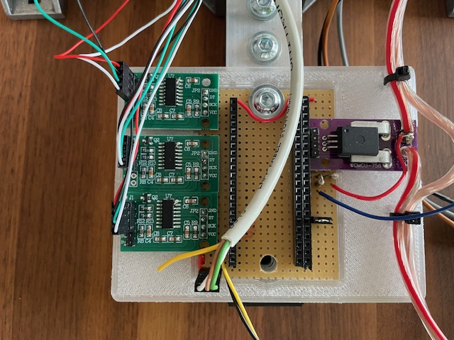
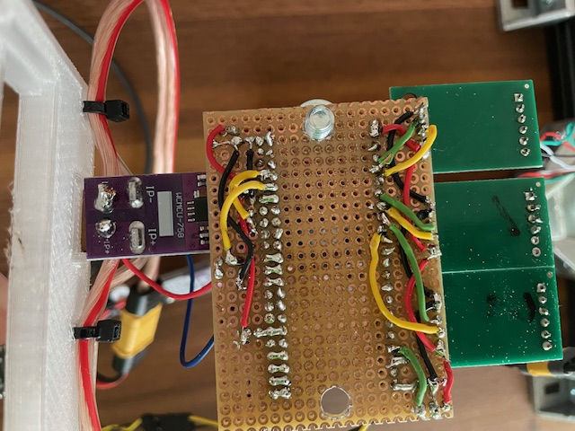
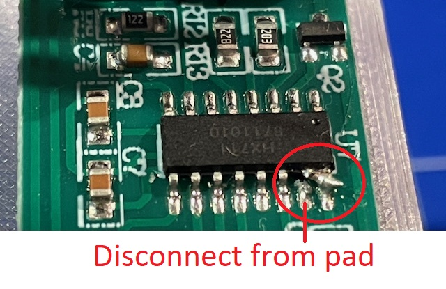
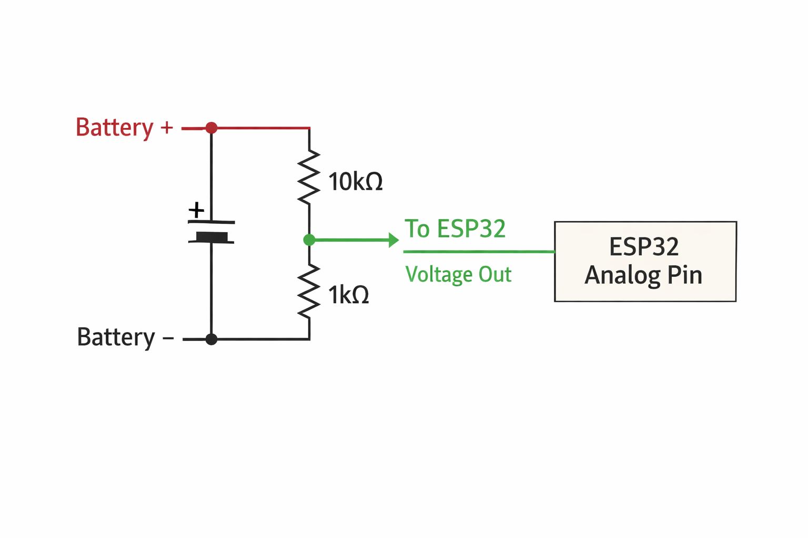
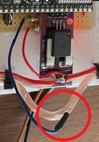

## Hardware

### Media

Some Images of how the hardware is build up.

- ESP32 Adapter and sensor electronics Top View  
  
  
- ESP32 Adapter and sensor electronics Bottom View  
  
  
- Infrared RPM sensor detail  
  

### Microcontroller

- ESP32-S3 WROOM-1 DevKit

### Sensors

- Thrust:
  - Load cell (5 kg) with HX711 ADC
- Torque:
  - Dual load cells (2 x 2 kg) with HX711 ADC
  - Lever-arm based torque calculation
- Current:
  - ACS758 hall-effect current sensor 50 A
- Voltage:
  - Resistor divider (10 kOhm / 1 kOhm, max approx. 33 V) - see notes below for variants
- RPM:
  - Infrared reflective optical sensor
- Temperature:
  - Thermocouple sensor (MAX31855) - prepared but not yet used

### Actuators and Safety

- Brushless ESC (PWM control)
- Configurable pulse range:
  - Default: 1000–2000 µs
  - Allowed: 800–2200 µs
- Hardware Emergency Stop (E-Stop)
- Propeller cage door safety switch
- RGB status LED

---

## Wiring / Pin Assignment

### ESP32-S3 WROOM-1 Pin Mapping

**Note:** All sensors are connected on 3.3V to ESP32 board.

| GPIO | Signal / Name | Direction | Connected Hardware | Notes |
|-----:|---------------|-----------|--------------------|-------|
| 0* | BOOT | Input | Boot button | Strapping pin |
| 1 | CURRENT_SENSOR_PIN | Input (ADC) | ACS758 current sensor OU2| Current measurement |
| 2 | VOLTAGE_SENSOR_PIN | Input (ADC) | Voltage divider (10k / 1k) | Max ~33 V |
| 4 | HX711_DOUT_1_PIN | Input | HX711 #1 (Thrust, 5 kg) | Data DT|
| 5 | HX711_SCK_1_PIN | Output | HX711 #1 (Thrust, 5 kg) | Clock SCK|
| 6 | HX711_DOUT_2_PIN | Input | HX711 #2 (Torque cell 1, 2 kg) | Data DT|
| 7 | HX711_SCK_2_PIN | Output | HX711 #2 (Torque cell 1, 2 kg) | Clock SCK|
| 13 | RPM_SENSOR_PIN | Input | IR reflective RPM sensor | Digital pulse input DOUT |
| 14 | MOTOR_ESC_PIN | Output (PWM) | Brushless ESC | Throttle control |
| 15 | HX711_DOUT_3_PIN | Input | HX711 #3 (Torque cell 2, 2 kg) | Data DT|
| 16 | HX711_SCK_3_PIN | Output | HX711 #3 (Torque cell 2, 2 kg) | Clock SCK|
| 17 | MAX31855_CS_PIN | Output | MAX31855 thermocouple | SPI chip select |
| 38 / 48 | RGB_BUILTIN_LED | Output | Onboard RGB LED | Status indication |
| 41 | I2C_SCL | I/O | I2C bus | Optional |
| 42 | CAGE_SWITCH_PIN | Input | Cage Door Open/Close Switch | Active safety input |
| 43 | UART_TX0 | Output | USB / Serial | Debug |
| 44 | UART_RX0 | Input | USB / Serial | Debug |
| 47 | ESTOP_PIN | Input | Emergency Stop | Active safety input |

- Strapping pins: GPIO 0, 3, 45, 46. Avoid changing their state during boot.

### Wiring Load Cells to HX711 board

|Wire Color | HX711 board |
|-----------|-------------|
| red | E+ |
| black | E- |
| green | A- |
| white | A+ |
| n.c. | B- |
| n.c. | B+ |

### Wiring Infrared Sensor

| Signal/Name |Wire Color  | TCRT5000 IR Infrared board |
|----------------|----------|----------------------------|
| 3.3V |white  | Vcc |
| Ground |brown  | GND |
| D0 |green  | D0ut |
| A0 |yellow (n.c.)  | A0 |

### Wiring Current Sensor ASC758

| Signal/Name | Current Sensor ASC758 board |
|----------------|----------------------------|
| 3.3V | Vcc |
| Ground  | GND |
| n.c.  | OU1 |
| CURRENT_SENSOR_PIN,corresponding Voltage | OU2 |

### Wiring ESC

| Signal/Name |Wire Color  |ESC |
|----------------|----------|----------------------------|
| GND | black |GND |
| MOTOR_ESC_PIN (PWM) | orange or whie | Signal |

---

Very helpful additions can be found at:
<https://github.com/iforce2d/thrustTester/tree/master>

### Motor speed controller

The ESC should use standard PWM. The default calibration range is 1000 µs for zero throttle and 2000 µs for full throttle.  
The software allows modifying this range from 800 µs to 2200 µs.

To find the correct settings for your ESC, unmount the propeller and move the throttle in the WEB UI to 100%.  
You should reach the maximum motor speed (kv-value × voltage) at 100%.  
If not, increase or decrease the *Max Pulse (µs)* value in the Calibration section of the WEB UI.

### Load cell amplifier

The HX711 can operate at either 10 Hz or 80 Hz update rate. Obviously, the faster rate is preferred, but most HX711 module boards are configured for 10 Hz by default.

To change the update rate to 80 Hz, disconnect the RATE pin (pin 15) from the PCB pad it is soldered to and connect it to VCC.  
The easiest way is to solder it to pin 16, which is located directly next to it.

**Important:** Make sure pin 15 is completely disconnected from the PCB pad. Otherwise, you risk a short circuit when connecting it to VCC.

Please see further details at:
<https://github.com/iforce2d/thrustTester/tree/master>

The load cells have an arrow indicating the direction of the applied force.  
This arrow should point in the direction where the force is acting, although the load cell will work in both directions.

#### Calibration procedure

1. In the Calibration section, set the *Thrust Cal-Factor* to **1**.
2. In the Live section, press the **“Tare Sensors”** button.
3. Place a defined weight at the center point of the propeller mount.
4. The calibration factor is calculated as:

   **Cal-Factor = Thrust value (Live view) / defined weight**

For calibration, a deflection holder was built to apply the defined weight:

The water bottle is suspended using a nylon cord and fixed at the center point with a screw or pin, as shown in the picture of the RPM sensor.

Another method is to rotate the thrust stand so the defined weight can be hung directly from the center point.

During calibration, the measured thrust value may drift (slowly decreasing) the longer the weight is applied.  
This behavior is typical for low-cost load cells. To reduce this effect, load cells with an accuracy class such as **C3** or **C4** should be used.

#### Torque sensor calibration

For calibrating the torque sensor, unmount the motor plate (or loosen the hinge screws) so that both load cells do not influence each other.  
This is also the reason why hinges are used for each torque load cell.

To simplify calibration, the torque sensor reports the **absolute torque value**, without information about the direction of rotation.

### Units & Calibration Philosophy

Although thrust is physically a force and its SI unit is **Newton (N)**, this project intentionally uses **grams (g)** as its primary internal unit.  
More precisely, all load-cell-based measurements are expressed in **gram-force (gf)**.

This choice is based on the calibration chain:

- Load cells measure force
- Calibration is performed using a known weight
- The reference weight is determined using a scale that displays grams
- The calibration therefore maps HX711 raw values directly to gram-force

As a result, the internal unit `g` represents **gram-force (gf)**, i.e. the force exerted by a mass of 1 g under Earth gravity.

This approach:

- Matches motor and propeller datasheets, which commonly specify thrust in grams
- Keeps calibration simple and intuitive
- Avoids embedding the gravitational constant into the calibration factor
- Ensures consistency across all load-cell-based measurements

**Torque measurement:**  
Motor torque is measured using two load cells and a known lever arm distance. Internally, torque is represented in **g·m (gram-force meters)**, which is fully consistent with the thrust unit.

For applications requiring SI units, conversion is straightforward:

- 1 g (gf) ≈ 0.00980665 N  
- 1 g·m ≈ 0.00980665 Nm

### Voltage Sensor

The voltage sensor uses a resistor divider of 10 kΩ / 1 kΩ.  
This limits the maximum measurable battery voltage to **36.3 V**, as the ESP32 ADC input must not exceed 3.3 V.  
Keep in mind that on a hard motor stop the voltage will spike. For 6S Batteries (25.2 nominal) this should work.  

For more security replace the 1 kΩ by a 820 Ω.  

Since the battery negative terminal must be connected to the ESP32 GND, a pin was directly inserted into the cable.

For calibration, a laboratory power supply was used and set to a known voltage (e.g. 22 V).  
Adjust the *Voltage Calibration* value in the Calibration section until the displayed live voltage matches the PSU value.

Because the ADC is highly linear, the calibration factor is limited to a range between **0.9 and 1.1**.

### Current Sensor ACS758

The 50 A version of the ACS758 sensor was used, together with a 2.5 mm² cable for the battery current path.  
Even ESCs rated at 45 A (e.g. Flycolor 45A) typically use AWG16 (1.31 mm²), so this setup is sufficiently robust.

In tests with currents up to 33 A, the cable did not heat up.  
XT60 connectors are used between the battery/PSU, current sensor, and ESC.

Calibration options:

1. Manually set the **Current Sensitivity** value (volts per amp), or  
2. Run the motor using a PSU at a known current (e.g. 8 A shown on the PSU) and enter this value into **“Actual Current (A)”**, then press **Set**.

### RPM Sensor TCRT5000 IR Infrared

The IR sensor core was desoldered and repositioned close to the motor rotor.  
Although the sensor sensitivity can be adjusted using a potentiometer, it is difficult to obtain a clean signal due to rotor reflections.

A strip of duct tape was used as a reflective marker, while the rest of the rotor was colored black using a non-permanent whiteboard marker.  
The tape covers approximately half the rotor circumference.

This setup works as long as ambient sunlight is not too strong. A laser-based sensor may be a better alternative.

Tests using propeller reflections were also performed, but at higher RPM the reflection time was too short for reliable detection.

---

## 3D Print Parts Notes

- ESP32 mounting plate: `cad/ESP32SensorAdapter.step`
- Infrared sensor housing: `cad/InfraredSensorHousing.step`
- Electronics housing:
  - `cad/ElectronicHousing.step`
  - `cad/ElectronicHousingCover.step`

M3 heat-set inserts are used for mounting.
